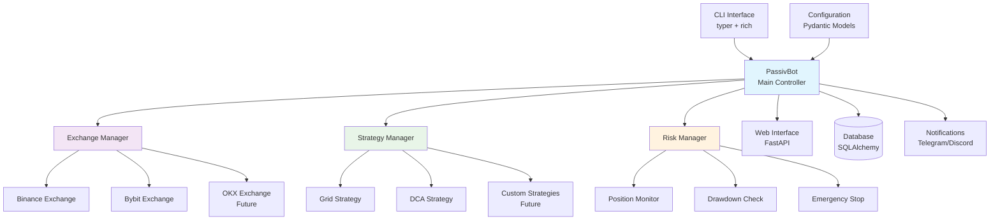

# System Architecture Overview

## Components Description

### Core Components
- **PassivBot**: Main controller orchestrating all operations
- **CLI Interface**: Command-line interface using typer and rich for user interaction
- **Configuration**: Pydantic-based configuration management with validation

### Managers
- **Exchange Manager**: Handles all exchange connections and API interactions
- **Strategy Manager**: Manages trading strategy execution and lifecycle
- **Risk Manager**: Monitors and enforces risk management rules

### Exchange Layer
- **Binance Exchange**: Implementation for Binance spot and futures trading
- **Bybit Exchange**: Implementation for Bybit trading platform
- **OKX Exchange**: Future implementation for OKX platform

### Strategy Layer
- **Grid Strategy**: Grid trading algorithm implementation
- **DCA Strategy**: Dollar Cost Averaging strategy implementation
- **Custom Strategies**: Extensible framework for additional strategies

### Supporting Systems
- **Database**: SQLAlchemy-based data persistence layer
- **Web Interface**: FastAPI-based web dashboard (future implementation)
- **Notifications**: Multi-channel notification system
