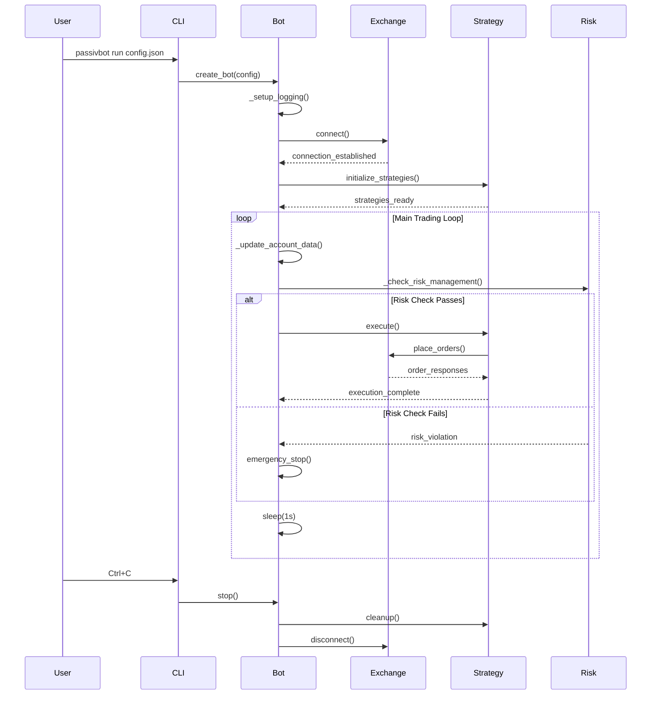

# Bot Lifecycle Flow

## Lifecycle Phases

### 1. Initialization Phase
1. **Configuration Loading**: Parse and validate configuration file
2. **Logging Setup**: Configure logging levels and output destinations
3. **Exchange Connection**: Establish API connections and test connectivity
4. **Strategy Initialization**: Create and configure trading strategies

### 2. Main Trading Loop
1. **Account Data Update**: Refresh balances, positions, and orders
2. **Risk Management Check**: Validate all risk parameters
3. **Strategy Execution**: Execute active trading strategies
4. **Order Management**: Place, modify, or cancel orders as needed
5. **Sleep Cycle**: Wait 1 second before next iteration

### 3. Shutdown Phase
1. **Signal Handling**: Respond to interrupt signals (Ctrl+C)
2. **Strategy Cleanup**: Cancel open orders and cleanup resources
3. **Exchange Disconnect**: Close API connections gracefully
4. **Final Logging**: Log shutdown completion and statistics
