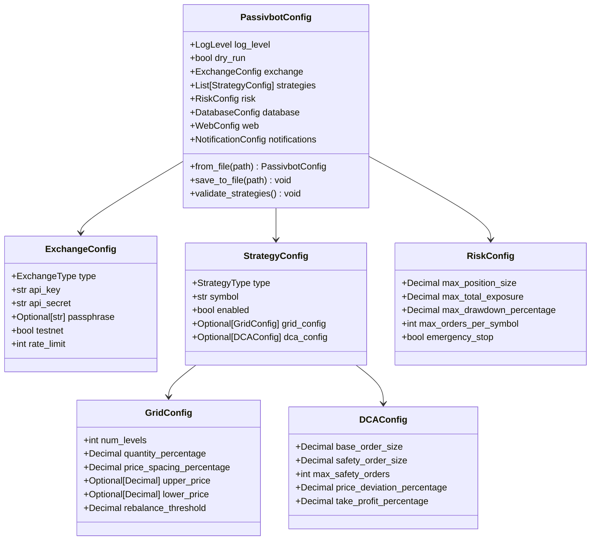

# Configuration System Structure

## Configuration Hierarchy

### Main Configuration (`PassivbotConfig`)
- **Global Settings**: Log level, dry run mode
- **Component Configs**: Exchange, strategies, risk management
- **System Configs**: Database, web interface, notifications

### Exchange Configuration (`ExchangeConfig`)
- **Connection Details**: API credentials and endpoints
- **Operational Settings**: Testnet mode, rate limiting
- **Security**: API key encryption support

### Strategy Configuration (`StrategyConfig`)
- **Strategy Selection**: Type and symbol specification
- **Strategy-Specific Settings**: Grid or DCA parameters
- **Control Settings**: Enable/disable individual strategies

### Risk Management (`RiskConfig`)
- **Position Limits**: Maximum position size and exposure
- **Safety Controls**: Drawdown limits and emergency stops
- **Order Management**: Maximum orders per symbol

## Configuration Features

### Validation
- **Type Checking**: Pydantic-based type validation
- **Business Rules**: Cross-field validation and constraints
- **Warning System**: Non-critical configuration warnings

### File Support
- **JSON Format**: Human-readable configuration files
- **Environment Variables**: Override settings via .env files
- **Template Generation**: Default configuration creation

### Security
- **API Key Protection**: Secure storage recommendations
- **Testnet Support**: Safe testing environment
- **Dry Run Mode**: Risk-free strategy testing
