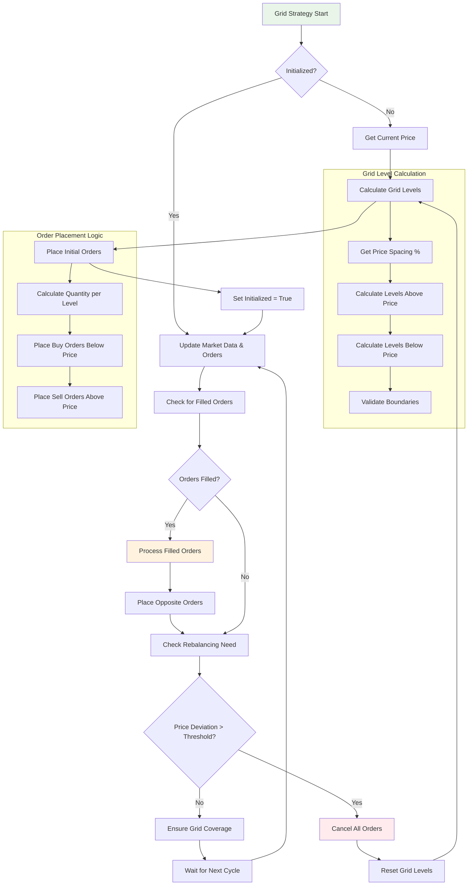

# Grid Trading Strategy Logic



## Grid Trading Algorithm

### Core Concept
Grid trading creates a "grid" of buy and sell orders at predetermined price levels around the current market price. When orders are filled, the strategy places new orders on the opposite side to capture price movements.

### Algorithm Steps

#### 1. Grid Initialization
1. **Current Price**: Get the current market price
2. **Level Calculation**: Calculate grid levels based on:
   - Number of levels (e.g., 10 levels)
   - Price spacing percentage (e.g., 0.5% between levels)
   - Optional upper and lower boundaries
3. **Order Placement**: Place buy orders below current price and sell orders above

#### 2. Order Management
1. **Fill Detection**: Monitor for filled orders every cycle
2. **Opposite Orders**: When a buy order fills → place sell order above
3. **Grid Maintenance**: Ensure coverage at all grid levels

#### 3. Rebalancing Logic
1. **Price Deviation Check**: Monitor how far price has moved from grid center
2. **Rebalance Trigger**: If deviation exceeds threshold (e.g., 5%)
3. **Grid Reset**: Cancel all orders and recalculate grid around new price

### Configuration Parameters

#### Grid Structure
- **`num_levels`**: Number of grid levels (default: 10)
- **`price_spacing_percentage`**: Spacing between levels (default: 0.5%)
- **`quantity_percentage`**: Percentage of balance per level (default: 10%)

#### Boundaries (Optional)
- **`upper_price`**: Maximum grid price
- **`lower_price`**: Minimum grid price
- **`rebalance_threshold`**: Price deviation to trigger rebalance (default: 5%)

### Risk Management

#### Position Limits
- Maximum position size per symbol
- Total exposure limits across all positions
- Emergency stop functionality

#### Order Management
- Maximum orders per symbol
- Automatic order cancellation on errors
- Balance validation before order placement

### Profit Mechanism

#### Buy Low, Sell High
1. **Buy Orders**: Placed below current price
2. **Price Drops**: Buy orders get filled
3. **Price Recovers**: Corresponding sell orders get filled
4. **Profit**: Difference between buy and sell prices minus fees

#### Market Making
- Provides liquidity to the market
- Profits from bid-ask spread and price volatility
- Works best in ranging/sideways markets

### Implementation Details

#### Order Tracking
```python
self._buy_orders: Dict[str, Order]   # Track buy orders
self._sell_orders: Dict[str, Order]  # Track sell orders
self._grid_levels: List[Decimal]     # Store calculated levels
```

#### Level Calculation Formula
```python
for i in range(1, num_levels // 2 + 1):
    upper_level = current_price * (1 + spacing * i)
    lower_level = current_price * (1 - spacing * i)
```

#### Quantity Calculation
```python
quantity_per_level = balance * (quantity_percentage / 100)
order_quantity = quantity_per_level / price_level
```

### Performance Considerations

#### Best Market Conditions
- **Ranging Markets**: High volatility within a range
- **Mean Reversion**: Markets that tend to return to average price
- **Sufficient Liquidity**: Adequate trading volume

#### Challenging Conditions
- **Strong Trends**: Sustained directional movement
- **Low Volatility**: Insufficient price movement for profits
- **Extreme Events**: Black swan events causing large price gaps
