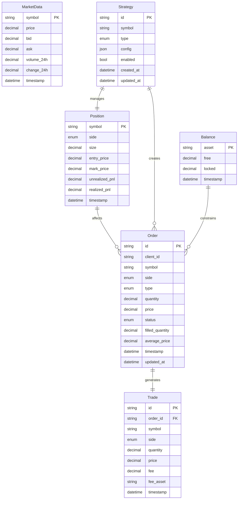

# Data Models and Relationships



## Core Data Models

### Order Model
Represents trading orders placed on exchanges.

#### Fields
- **`id`**: Unique exchange-provided order ID
- **`client_id`**: Client-generated unique identifier
- **`symbol`**: Trading pair (e.g., "BTCUSDT")
- **`side`**: Order direction (BUY/SELL)
- **`type`**: Order type (MARKET/LIMIT/STOP_LOSS/TAKE_PROFIT)
- **`quantity`**: Order quantity in base asset
- **`price`**: Order price (null for market orders)
- **`status`**: Current order status
- **`filled_quantity`**: Amount filled so far
- **`average_price`**: Average fill price
- **`timestamp`**: Order creation time
- **`updated_at`**: Last update time

#### Order Status Enum
```python
class OrderStatus(str, Enum):
    PENDING = "pending"           # Order submitted but not confirmed
    OPEN = "open"                # Order active on exchange
    FILLED = "filled"            # Order completely filled
    PARTIALLY_FILLED = "partially_filled"  # Order partially filled
    CANCELLED = "cancelled"      # Order cancelled
    REJECTED = "rejected"        # Order rejected by exchange
```

#### Business Logic
```python
@property
def is_filled(self) -> bool:
    return self.status == OrderStatus.FILLED

@property
def remaining_quantity(self) -> Decimal:
    return self.quantity - self.filled_quantity
```

### Position Model
Represents open trading positions.

#### Fields
- **`symbol`**: Trading pair identifier
- **`side`**: Position direction (LONG/SHORT)
- **`size`**: Position size in base asset
- **`entry_price`**: Average entry price
- **`mark_price`**: Current market price
- **`unrealized_pnl`**: Unrealized profit/loss
- **`realized_pnl`**: Realized profit/loss
- **`timestamp`**: Position timestamp

#### Calculated Properties
```python
@property
def notional_value(self) -> Decimal:
    return self.size * self.mark_price

@property
def pnl_percentage(self) -> Decimal:
    if self.entry_price > 0:
        return (self.mark_price - self.entry_price) / self.entry_price * 100
    return Decimal("0")
```

### Balance Model
Represents account balances for different assets.

#### Fields
- **`asset`**: Asset symbol (e.g., "BTC", "USDT")
- **`free`**: Available balance for trading
- **`locked`**: Balance locked in orders
- **`timestamp`**: Balance timestamp

#### Calculated Properties
```python
@property
def total(self) -> Decimal:
    return self.free + self.locked

@property
def utilization_ratio(self) -> Decimal:
    if self.total > 0:
        return self.locked / self.total
    return Decimal("0")
```

### Trade Model
Represents executed trades.

#### Fields
- **`id`**: Unique trade identifier
- **`order_id`**: Related order ID
- **`symbol`**: Trading pair
- **`side`**: Trade direction
- **`quantity`**: Trade quantity
- **`price`**: Execution price
- **`fee`**: Trading fee amount
- **`fee_asset`**: Fee currency
- **`timestamp`**: Execution timestamp

#### Calculations
```python
@property
def notional_value(self) -> Decimal:
    return self.quantity * self.price

@property
def net_value(self) -> Decimal:
    if self.side == OrderSide.BUY:
        return -(self.notional_value + self.fee)
    else:
        return self.notional_value - self.fee
```

### MarketData Model
Represents current market information.

#### Fields
- **`symbol`**: Trading pair
- **`price`**: Current price
- **`bid`**: Best bid price
- **`ask`**: Best ask price
- **`volume_24h`**: 24-hour trading volume
- **`change_24h`**: 24-hour price change percentage
- **`timestamp`**: Data timestamp

#### Derived Metrics
```python
@property
def spread(self) -> Optional[Decimal]:
    if self.bid and self.ask:
        return self.ask - self.bid
    return None

@property
def spread_percentage(self) -> Optional[Decimal]:
    if self.spread and self.price > 0:
        return self.spread / self.price * 100
    return None
```

### Strategy Model
Represents strategy configurations and state.

#### Fields
- **`id`**: Unique strategy identifier
- **`symbol`**: Trading symbol
- **`type`**: Strategy type (GRID/DCA/etc.)
- **`config`**: Strategy-specific configuration
- **`enabled`**: Whether strategy is active
- **`created_at`**: Strategy creation time
- **`updated_at`**: Last configuration update

## Data Relationships

### Order → Trade Relationship
- **One-to-Many**: One order can generate multiple trades
- **Tracking**: Trades reference parent order via `order_id`
- **Aggregation**: Order fill status calculated from related trades

### Strategy → Order Relationship
- **One-to-Many**: One strategy creates multiple orders
- **Ownership**: Orders tagged with strategy identifier
- **Lifecycle**: Strategy manages order creation and cancellation

### Strategy → Position Relationship
- **One-to-One**: One strategy per symbol manages one position
- **State Sync**: Position updates affect strategy decisions
- **Risk Management**: Position size influences strategy behavior

### Balance → Order Relationship
- **Constraint**: Available balance limits order placement
- **Updates**: Order fills update balance allocations
- **Validation**: Pre-trade balance checks prevent overallocation

## Data Persistence Strategy

### Database Schema
```sql
-- Orders table
CREATE TABLE orders (
    id VARCHAR(50) PRIMARY KEY,
    client_id VARCHAR(50) UNIQUE,
    symbol VARCHAR(20) NOT NULL,
    side VARCHAR(10) NOT NULL,
    type VARCHAR(20) NOT NULL,
    quantity DECIMAL(20,8) NOT NULL,
    price DECIMAL(20,8),
    status VARCHAR(20) NOT NULL,
    filled_quantity DECIMAL(20,8) DEFAULT 0,
    average_price DECIMAL(20,8),
    timestamp TIMESTAMP DEFAULT CURRENT_TIMESTAMP,
    updated_at TIMESTAMP DEFAULT CURRENT_TIMESTAMP ON UPDATE CURRENT_TIMESTAMP,
    INDEX idx_symbol_status (symbol, status),
    INDEX idx_timestamp (timestamp)
);

-- Positions table
CREATE TABLE positions (
    symbol VARCHAR(20) PRIMARY KEY,
    side VARCHAR(10) NOT NULL,
    size DECIMAL(20,8) NOT NULL,
    entry_price DECIMAL(20,8) NOT NULL,
    mark_price DECIMAL(20,8),
    unrealized_pnl DECIMAL(20,8) DEFAULT 0,
    realized_pnl DECIMAL(20,8) DEFAULT 0,
    timestamp TIMESTAMP DEFAULT CURRENT_TIMESTAMP ON UPDATE CURRENT_TIMESTAMP
);

-- Balances table
CREATE TABLE balances (
    asset VARCHAR(10) PRIMARY KEY,
    free DECIMAL(20,8) NOT NULL DEFAULT 0,
    locked DECIMAL(20,8) NOT NULL DEFAULT 0,
    timestamp TIMESTAMP DEFAULT CURRENT_TIMESTAMP ON UPDATE CURRENT_TIMESTAMP
);
```

### Caching Strategy
- **In-Memory Cache**: Hot data for active trading
- **Redis Cache**: Shared cache for multiple bot instances
- **Database**: Persistent storage for historical data
- **Cache Invalidation**: Time-based and event-driven updates

### Data Synchronization
- **Real-Time Updates**: WebSocket feeds for live data
- **Periodic Sync**: Regular full synchronization with exchange
- **Conflict Resolution**: Last-writer-wins for order updates
- **Audit Trail**: Complete history of all data changes

## Performance Considerations

### Query Optimization
- **Indexes**: Strategic indexing on frequently queried fields
- **Partitioning**: Time-based partitioning for historical data
- **Aggregation**: Pre-calculated aggregates for reporting
- **Connection Pooling**: Efficient database connection management

### Memory Management
- **Object Pooling**: Reuse model objects to reduce GC pressure
- **Lazy Loading**: Load related data only when needed
- **Batch Operations**: Bulk database operations for efficiency
- **Memory Monitoring**: Track memory usage and optimize accordingly

### Data Archival
- **Hot/Cold Storage**: Recent data in fast storage, older data archived
- **Compression**: Compress historical data to save space
- **Retention Policies**: Automatic cleanup of old data
- **Backup Strategy**: Regular backups of critical trading data
