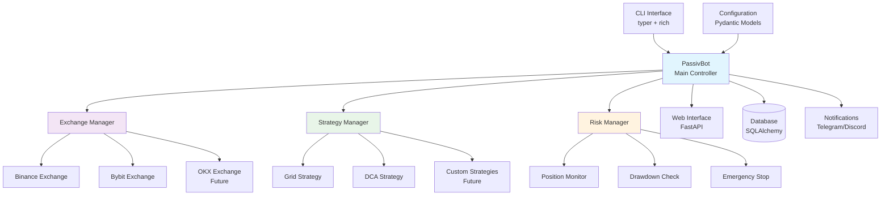
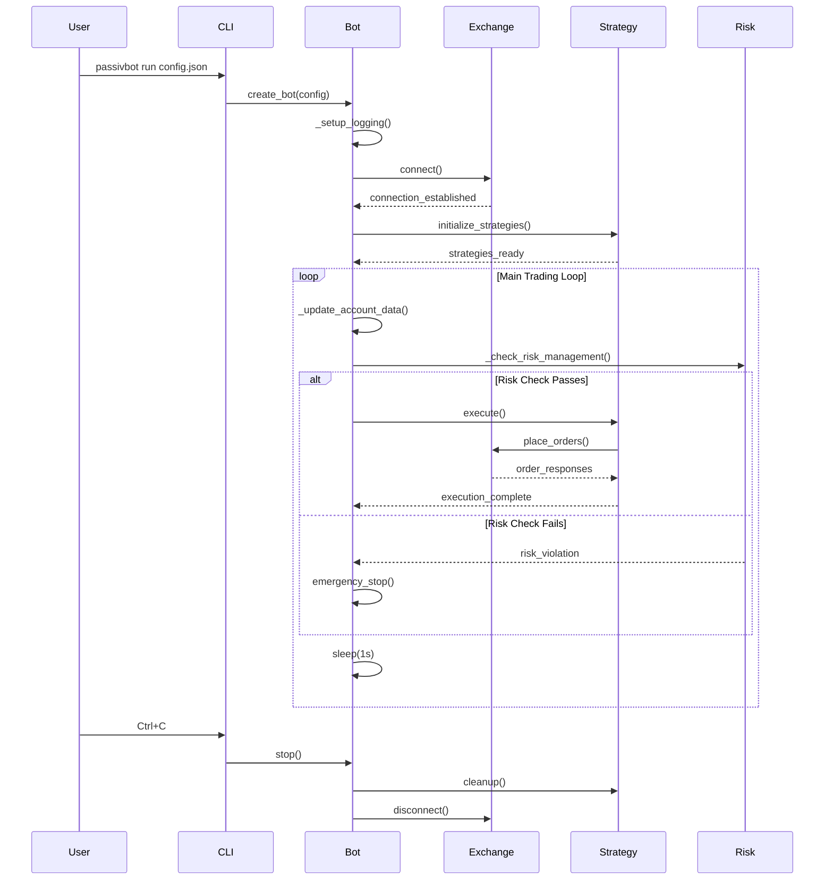
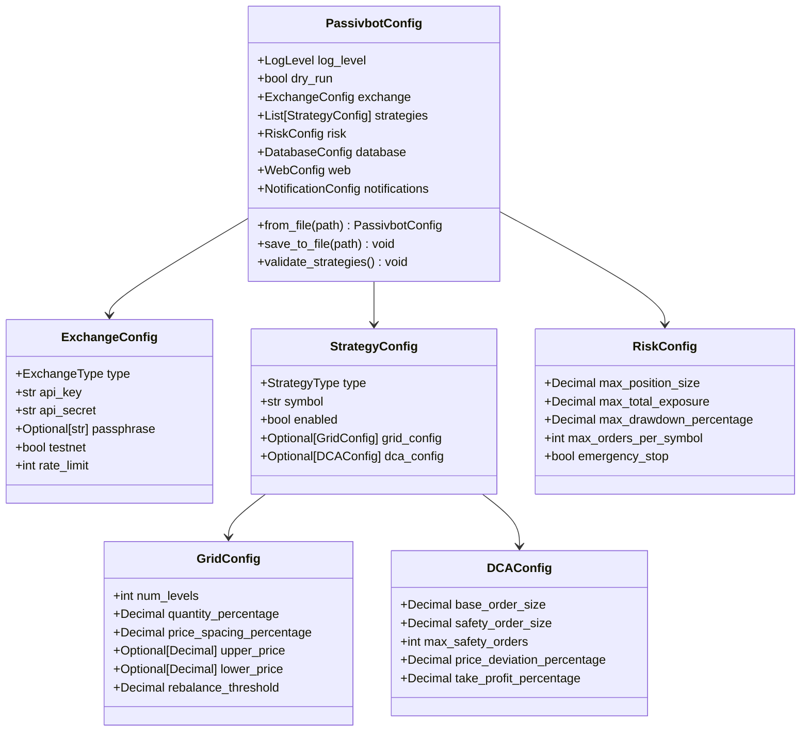
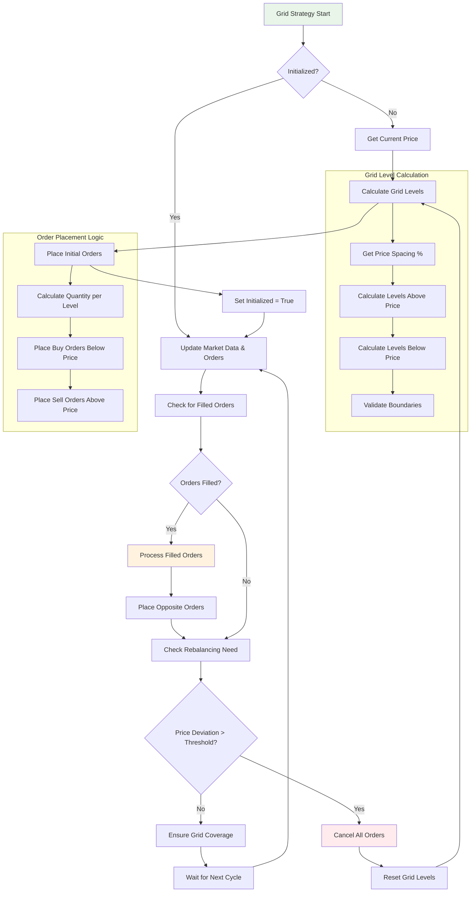
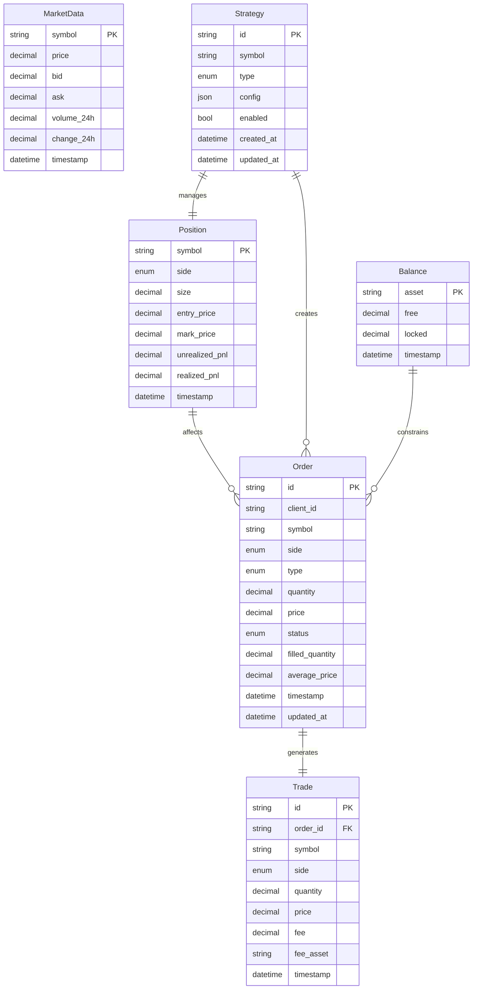
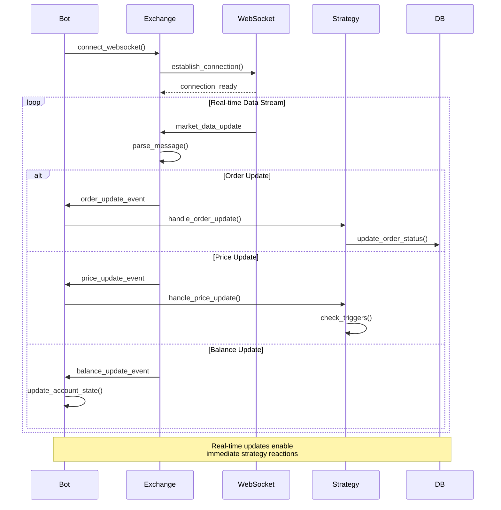

# Passivbot v2.0 Architecture Diagrams

This document contains various diagrams to visualize the system architecture, data flow, and trading logic.

## 1. System Architecture Overview



## 2. Bot Lifecycle Flow



## 3. Configuration System Structure



## 4. Exchange Layer Architecture

```mermaid
graph TB
    subgraph "Exchange Layer"
        Base[BaseExchange<br/>Abstract Interface]
        
        subgraph "Implementations"
            Binance[BinanceExchange]
            Bybit[BybitExchange] 
            OKX[OKXExchange<br/>Future]
        end
        
        Registry[Exchange Registry<br/>get_exchange()]
    end
    
    subgraph "Core Methods"
        Account[Account Methods<br/>get_balances()<br/>get_positions()]
        Orders[Order Methods<br/>place_order()<br/>cancel_order()<br/>get_orders()]
        Market[Market Data<br/>get_market_data()<br/>get_orderbook()]
        Trading[Trading Helpers<br/>buy_market()<br/>sell_limit()<br/>etc.]
    end
    
    subgraph "External APIs"
        BinanceAPI[Binance API<br/>REST + WebSocket]
        BybitAPI[Bybit API<br/>REST + WebSocket]
        OKXAPI[OKX API<br/>REST + WebSocket]
    end
    
    Base --> Binance
    Base --> Bybit
    Base --> OKX
    
    Registry --> Base
    
    Base --> Account
    Base --> Orders
    Base --> Market
    Base --> Trading
    
    Binance --> BinanceAPI
    Bybit --> BybitAPI
    OKX --> OKXAPI
    
    style Base fill:#e3f2fd
    style Registry fill:#f3e5f5
```

## 5. Grid Trading Strategy Logic



## 6. DCA Strategy Logic

```mermaid
flowchart TD
    Start[DCA Strategy Start] --> Init{Initialized?}
    
    Init -->|No| CheckBalance[Check USDT Balance]
    CheckBalance --> PlaceBase[Place Base Order<br/>Market Buy]
    PlaceBase --> SetEntry[Set Entry Price]
    SetEntry --> PlaceTP[Place Take Profit Order]
    PlaceTP --> SetInit[Set Initialized = True]
    
    Init -->|Yes| Update[Update Orders & Positions]
    SetInit --> Update
    
    Update --> CheckBase{Base Order Filled?}
    
    CheckBase -->|Yes| UpdateEntry[Update Entry Price]
    UpdateEntry --> UpdateTP[Update Take Profit]
    UpdateTP --> CheckSafety
    
    CheckBase -->|No| CheckSafety[Check Safety Orders]
    
    CheckSafety --> SafetyFilled{Safety Order Filled?}
    
    SafetyFilled -->|Yes| IncSafetyCount[Increment Safety Count]
    IncSafetyCount --> RecalcEntry[Recalculate Avg Entry]
    RecalcEntry --> UpdateTP
    
    SafetyFilled -->|No| CheckTP[Check Take Profit]
    
    CheckTP --> TPFilled{Take Profit Filled?}
    
    TPFilled -->|Yes| Reset[Reset DCA State]
    Reset --> Profit[Profit Realized]
    Profit --> Start
    
    TPFilled -->|No| CheckPrice[Check Current Price]
    
    CheckPrice --> NeedSafety{Price Hit Safety Level?}
    
    NeedSafety -->|Yes| CheckCount{Safety Count < Max?}
    CheckCount -->|Yes| PlaceSafety[Place Safety Order]
    PlaceSafety --> Wait
    CheckCount -->|No| Wait
    
    NeedSafety -->|No| CheckStopLoss{Stop Loss Enabled?}
    
    CheckStopLoss -->|Yes| StopLossHit{Price Hit Stop Loss?}
    StopLossHit -->|Yes| ExecuteStop[Execute Stop Loss<br/>Market Sell All]
    ExecuteStop --> Reset
    
    CheckStopLoss -->|No| Wait[Wait for Next Cycle]
    StopLossHit -->|No| Wait
    Wait --> Update
    
    subgraph "Safety Order Calculation"
        PlaceSafety --> CalcPrice[Price = Entry × (1 - deviation × step_scale^count)]
        CalcPrice --> CalcQty[Quantity = safety_size × volume_scale^count / price]
    end
    
    subgraph "Take Profit Calculation"
        PlaceTP --> TPPrice[TP Price = Entry × (1 + tp_percentage)]
        TPPrice --> TPQty[TP Quantity = Total Position Size]
    end
    
    style Start fill:#e8f5e8
    style Profit fill:#e8f5e8
    style ExecuteStop fill:#ffebee
    style PlaceSafety fill:#fff3e0
```

## 7. Risk Management Flow

```mermaid
flowchart TD
    Start[Risk Check Start] --> EmergencyStop{Emergency Stop<br/>Activated?}
    
    EmergencyStop -->|Yes| StopAll[Stop All Trading<br/>Cancel Orders]
    StopAll --> Alert[Send Alert]
    Alert --> End[End Trading]
    
    EmergencyStop -->|No| CheckDrawdown[Calculate Current Drawdown]
    
    CheckDrawdown --> DrawdownCalc[Drawdown = (Peak - Current) / Peak × 100]
    
    DrawdownCalc --> DrawdownCheck{Drawdown > Max?}
    
    DrawdownCheck -->|Yes| DrawdownStop[Maximum Drawdown<br/>Exceeded]
    DrawdownStop --> StopAll
    
    DrawdownCheck -->|No| CheckPosition[Check Position Sizes]
    
    CheckPosition --> PositionLoop{For Each Position}
    
    PositionLoop --> CheckSize{Position > Max Size?}
    
    CheckSize -->|Yes| ReducePosition[Reduce Position<br/>Partial Close]
    ReducePosition --> LogWarning[Log Warning]
    LogWarning --> NextPosition
    
    CheckSize -->|No| NextPosition[Next Position]
    NextPosition --> MorePositions{More Positions?}
    
    MorePositions -->|Yes| PositionLoop
    MorePositions -->|No| CheckExposure[Check Total Exposure]
    
    CheckExposure --> ExposureCalc[Total Exposure = Sum(Position Values)]
    ExposureCalc --> ExposureCheck{Exposure > Max?}
    
    ExposureCheck -->|Yes| ReduceExposure[Reduce Largest Positions]
    ReduceExposure --> LogWarning
    
    ExposureCheck -->|No| CheckOrders[Check Order Counts]
    
    CheckOrders --> OrderLoop{For Each Symbol}
    OrderLoop --> CountOrders[Count Open Orders]
    CountOrders --> OrderCheck{Orders > Max per Symbol?}
    
    OrderCheck -->|Yes| CancelOldest[Cancel Oldest Orders]
    CancelOldest --> NextSymbol
    
    OrderCheck -->|No| NextSymbol[Next Symbol]
    NextSymbol --> MoreSymbols{More Symbols?}
    
    MoreSymbols -->|Yes| OrderLoop
    MoreSymbols -->|No| Pass[Risk Check Passed]
    
    Pass --> Continue[Continue Trading]
    
    style Start fill:#e3f2fd
    style Pass fill:#e8f5e8
    style StopAll fill:#ffebee
    style DrawdownStop fill:#ffebee
    style ReducePosition fill:#fff3e0
```

## 8. Data Models Relationship



## 9. WebSocket Data Flow



## 10. Error Handling Hierarchy

```mermaid
graph TD
    BaseError[PassivbotError<br/>Base Exception] --> ConfigError[ConfigurationError]
    BaseError --> ExchangeError[ExchangeError]
    BaseError --> StrategyError[StrategyError]
    BaseError --> RiskError[RiskManagementError]
    BaseError --> DataError[DataError]
    BaseError --> ValidationError[ValidationError]
    BaseError --> BacktestError[BacktestError]
    BaseError --> NotificationError[NotificationError]
    BaseError --> WebError[WebInterfaceError]
    
    ExchangeError --> ConnError[ExchangeConnectionError]
    ExchangeError --> APIError[ExchangeAPIError]
    ExchangeError --> BalanceError[InsufficientBalanceError]
    
    StrategyError --> InvalidStrategy[InvalidStrategyError]
    StrategyError --> ExecutionError[StrategyExecutionError]
    
    RiskError --> MaxPositionError[MaxPositionSizeExceededError]
    RiskError --> DrawdownError[MaxDrawdownExceededError]
    
    DataError --> DBError[DatabaseError]
    
    ValidationError --> PriceError[InvalidPriceError]
    ValidationError --> QtyError[InvalidQuantityError]
    
    BacktestError --> DataInsufficient[InsufficientDataError]
    
    subgraph "Error Handling Utils"
        HandleExchange[handle_exchange_error()]
        IsRetriable[is_retriable_error()]
        RetryLogic[Exponential Backoff<br/>Circuit Breaker]
    end
    
    ExchangeError -.-> HandleExchange
    APIError -.-> IsRetriable
    ConnError -.-> RetryLogic
    
    style BaseError fill:#e3f2fd
    style ExchangeError fill:#fff3e0
    style StrategyError fill:#e8f5e8
    style RiskError fill:#ffebee
```

These diagrams provide a comprehensive visualization of:

1. **System Architecture** - Overall component structure
2. **Bot Lifecycle** - Sequence of operations during bot execution
3. **Configuration** - Data model relationships
4. **Exchange Layer** - Abstraction and implementation structure  
5. **Grid Strategy** - Trading logic flow
6. **DCA Strategy** - Dollar cost averaging logic
7. **Risk Management** - Safety checks and controls
8. **Data Models** - Entity relationships
9. **WebSocket Flow** - Real-time data handling
10. **Error Handling** - Exception hierarchy and recovery

These visual representations help understand the complex interactions between different parts of the system and the flow of data and control throughout the trading bot.
