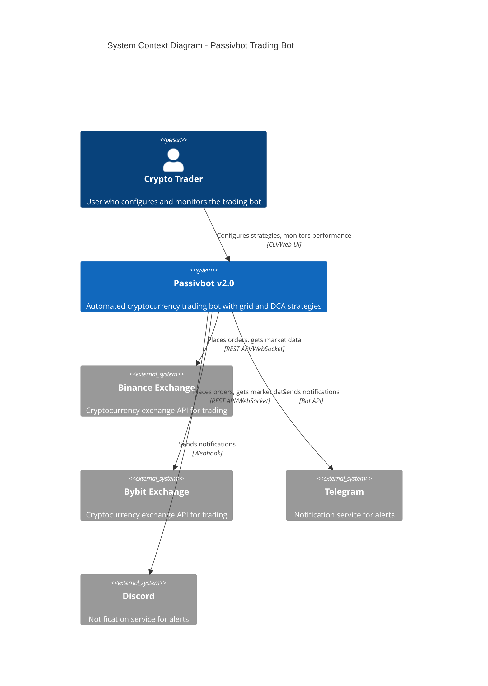
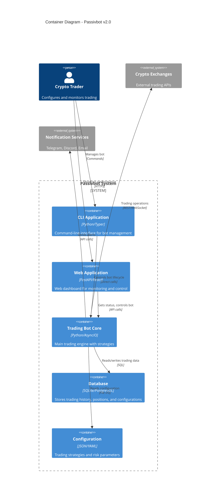
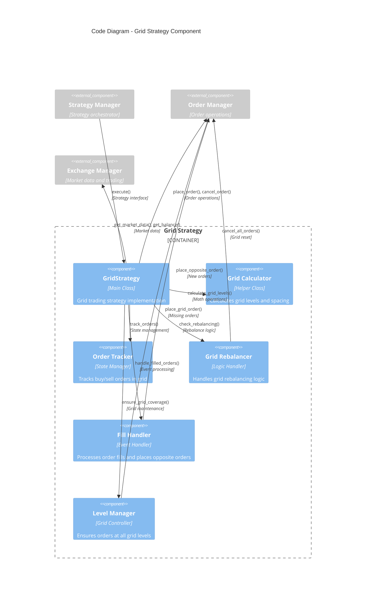
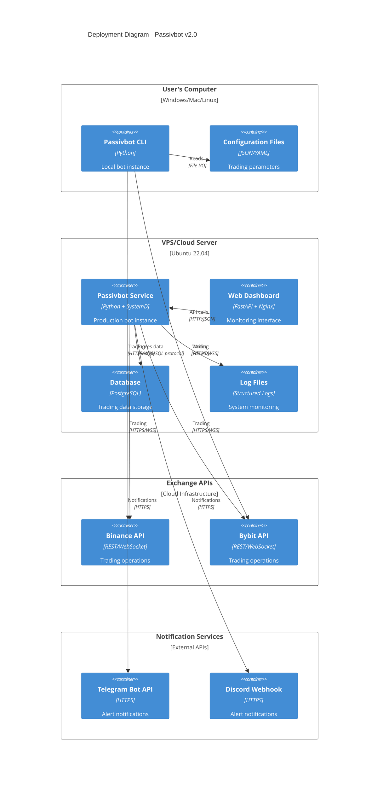
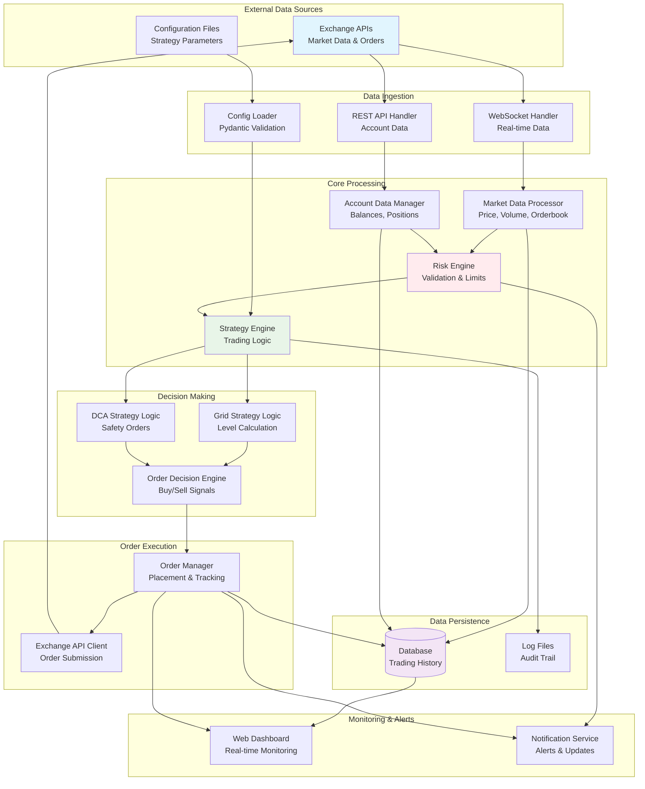
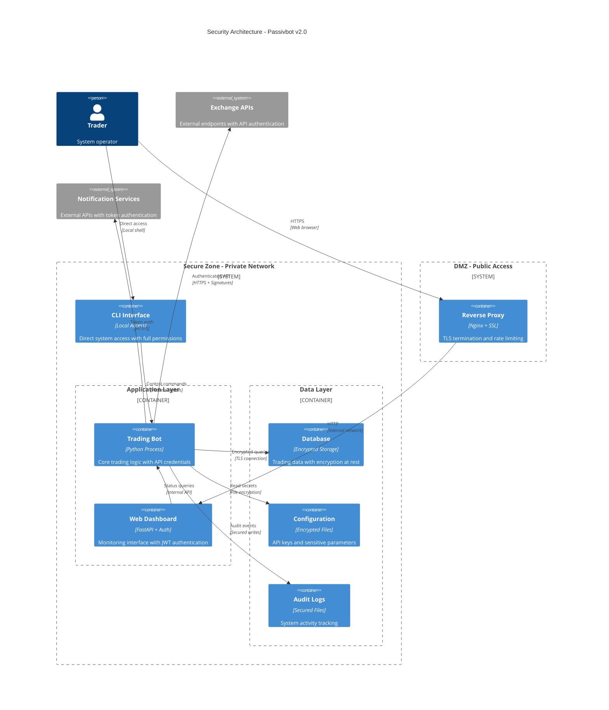

# Passivbot v2.0 - C4 Model Architecture

This document presents the Passivbot system architecture using the C4 model approach, showing the system at different levels of abstraction.

## Level 1: System Context Diagram

Shows how Passivbot fits into the overall environment and interacts with external systems.

## Level 2: Container Diagram

Shows the major containers (applications, databases, etc.) that make up Passivbot.

## Level 3: Component Diagram - Trading Bot Core

Shows the internal components of the main trading bot container.

```mermaid
C4Component
    title Component Diagram - Trading Bot Core

    Container(web, "Web Application", "FastAPI", "Web dashboard")
    Container(cli, "CLI Application", "Python/Typer", "Command line interface")
    Container(db, "Database", "SQLite/PostgreSQL", "Data persistence")

    Container_Boundary(c1, "Trading Bot Core") {
        Component(bot_controller, "Bot Controller", "PassivBot Class", "Main orchestrator managing bot lifecycle")
        Component(config_manager, "Configuration Manager", "Pydantic Models", "Loads and validates configuration")
        Component(risk_manager, "Risk Manager", "Risk Controller", "Monitors drawdown, position sizes, and stops")
        
        Component(exchange_manager, "Exchange Manager", "Exchange Registry", "Manages exchange connections and operations")
        Component(binance_impl, "Binance Implementation", "BinanceExchange", "Binance-specific API integration")
        Component(bybit_impl, "Bybit Implementation", "BybitExchange", "Bybit-specific API integration")
        
        Component(strategy_manager, "Strategy Manager", "Strategy Registry", "Orchestrates trading strategies")
        Component(grid_strategy, "Grid Strategy", "GridStrategy Class", "Grid trading algorithm implementation")
        Component(dca_strategy, "DCA Strategy", "DCAStrategy Class", "Dollar cost averaging algorithm")
        
        Component(order_manager, "Order Manager", "Order Controller", "Manages order lifecycle and state")
        Component(position_tracker, "Position Tracker", "Position Monitor", "Tracks open positions and P&L")
        Component(market_data, "Market Data Handler", "Data Processor", "Processes real-time market data")
        Component(notification_service, "Notification Service", "Alert Manager", "Sends notifications and alerts")
    }

    System_Ext(exchanges, "External Exchanges", "Trading APIs")
    System_Ext(notifications, "External Notifications", "Telegram/Discord")

    Rel(cli, bot_controller, "Controls", "Method calls")
    Rel(web, bot_controller, "Status/Control", "API")
    Rel(bot_controller, config_manager, "Loads config", "Pydantic")
    Rel(bot_controller, risk_manager, "Risk checks", "Validation")
    Rel(bot_controller, exchange_manager, "Exchange ops", "Interface")
    Rel(bot_controller, strategy_manager, "Execute strategies", "Strategy calls")
    
    Rel(exchange_manager, binance_impl, "Binance calls", "Implementation")
    Rel(exchange_manager, bybit_impl, "Bybit calls", "Implementation")
    Rel(binance_impl, exchanges, "API calls", "REST/WS")
    Rel(bybit_impl, exchanges, "API calls", "REST/WS")
    
    Rel(strategy_manager, grid_strategy, "Execute grid", "Strategy pattern")
    Rel(strategy_manager, dca_strategy, "Execute DCA", "Strategy pattern")
    Rel(grid_strategy, order_manager, "Place orders", "Order ops")
    Rel(dca_strategy, order_manager, "Place orders", "Order ops")
    
    Rel(order_manager, exchange_manager, "Order operations", "Exchange interface")
    Rel(position_tracker, exchange_manager, "Position updates", "Data sync")
    Rel(market_data, exchange_manager, "Market updates", "WebSocket")
    Rel(notification_service, notifications, "Send alerts", "External API")
    
    Rel(bot_controller, db, "Persist data", "ORM")
    Rel(order_manager, db, "Save orders", "SQL")
    Rel(position_tracker, db, "Save positions", "SQL")

    UpdateLayoutConfig($c4ShapeInRow="3", $c4BoundaryInRow="2")
```

## Level 4: Code Diagram - Grid Strategy Component

Shows the internal structure of the Grid Strategy component.

## Deployment Diagram

Shows how Passivbot is deployed in different environments.

## Data Flow Diagram

Shows how data flows through the system during trading operations.

## Security Architecture

Shows security boundaries and data protection measures.

## Key Architecture Principles

### 1. **Separation of Concerns**
- **Exchange Layer**: Handles all external API interactions
- **Strategy Layer**: Contains pure trading logic
- **Risk Layer**: Manages safety and compliance
- **Data Layer**: Handles persistence and state management

### 2. **Scalability**
- **Async Architecture**: Non-blocking I/O for concurrent operations
- **Modular Design**: Easy to add new exchanges and strategies
- **Resource Management**: Rate limiting and connection pooling

### 3. **Reliability**
- **Error Handling**: Comprehensive exception hierarchy
- **State Recovery**: Persistent state across restarts
- **Circuit Breakers**: Automatic failure detection and recovery

### 4. **Security**
- **Credential Management**: Encrypted storage of API keys
- **Input Validation**: Pydantic models for all data
- **Audit Logging**: Complete activity tracking
- **Network Security**: TLS encryption for all communications

### 5. **Observability**
- **Structured Logging**: JSON logs for analysis
- **Metrics Collection**: Performance and trading metrics
- **Real-time Monitoring**: Web dashboard with live updates
- **Alerting**: Multi-channel notification system

This C4 model provides a comprehensive view of the Passivbot architecture from high-level system context down to detailed component interactions, making it easy to understand the system at different levels of abstraction.
